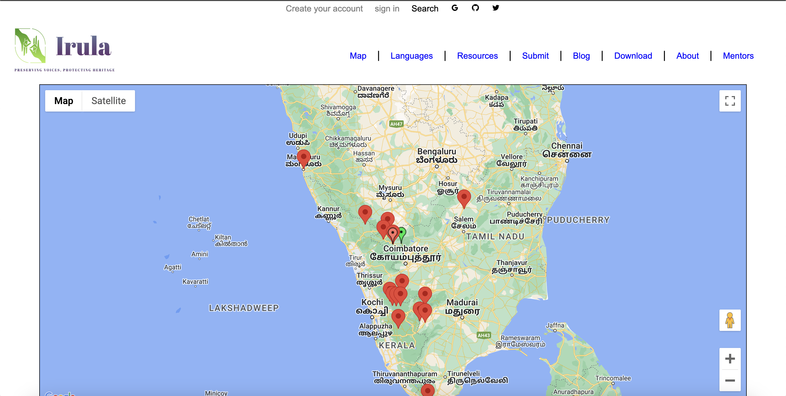
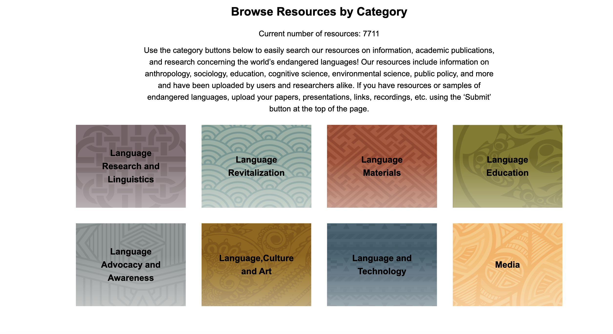
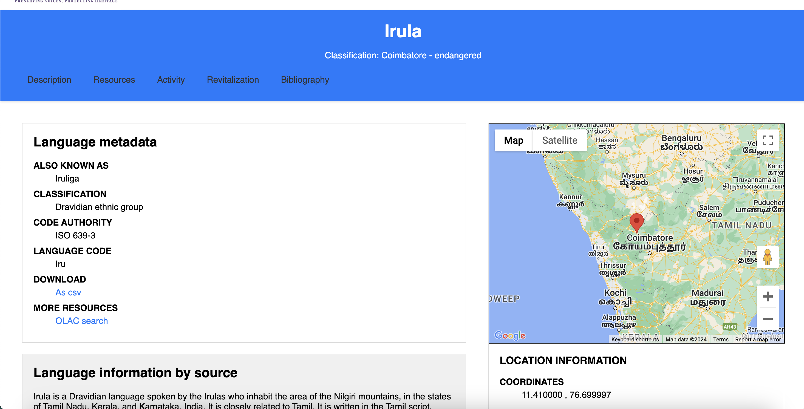

# Irula-Endangered-Language

This project is dedicated to creating an interactive map showcasing the distribution and details of the Irula language, which is considered endangered. The map will feature hover and zoom functionality, displaying relevant content on hover.

## Authors
- [Rohit Kumar](www.rohitsaraf.in)
- [Prathamesh Patwardhan](https://portfolioprathamesh.netlify.app/)

## Table of Contents
- [Introduction](#introduction)
- [Images](#images)
- [Features](#features)
- [Technologies Used](#technologies-used)
- [Installation](#installation)
- [Usage](#usage)
- [Contributing](#contributing)
- [License](#license)
- [Acknowledgments](#acknowledgments)

## Introduction
The Irula language, spoken by the Irula people in the southern parts of India, is facing the threat of extinction. This project aims to raise awareness about the language by providing an interactive map that displays information about the Irula-speaking regions, their cultural significance, and more.

## Images





## Features
- Interactive map with hover and zoom functionality.
- Display of information about Irula language and culture on hover.
- Responsive design for optimal viewing on different devices.
- User-friendly interface for easy navigation.

## Technologies Used
- HTML
- CSS
- JavaScript
- Leaflet.js
- Google Maps API

## Installation
To get started with the project, follow these steps:

1. Clone the repository:
    ```bash
    git clone https://github.com/yourusername/Irula-Endangered-Language.git
    ```

2. Navigate to the project directory:
    ```bash
    cd Irula-Endangered-Language
    ```

3. Open `index.html` in your preferred web browser.

## Usage
Once the project is set up, you can explore the interactive map by hovering over different regions to see information about the Irula language and culture. Use the zoom functionality to get a closer look at specific areas.

## Contributing
We welcome contributions from the community. To contribute to the project, follow these steps:

1. Fork the repository.
2. Create a new branch:
    ```bash
    git checkout -b feature-name
    ```
3. Make your changes and commit them:
    ```bash
    git commit -m "Description of the changes"
    ```
4. Push to the branch:
    ```bash
    git push origin feature-name
    ```
5. Open a pull request and describe your changes in detail.

## License
This project is licensed under the MIT License. See the [LICENSE](LICENSE) file for more details.

## Acknowledgments
We would like to thank the following resources and communities for their support and contributions:
- Leaflet.js for providing an excellent mapping library.
- Google Maps API for additional mapping features.
- OpenStreetMap for the geospatial data.
- Our mentors and peers for their invaluable feedback and encouragement.

For more information, please contact any of the authors:

- Rohit Kumar: rohitkumar620200@gmail.com
- Samriddhi Dubey: sd9643@srmist.edu.in
- Prathmesh Pathwardhan: pmp31104@gmail.com
